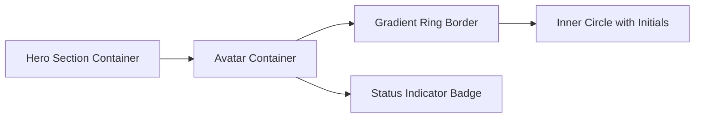
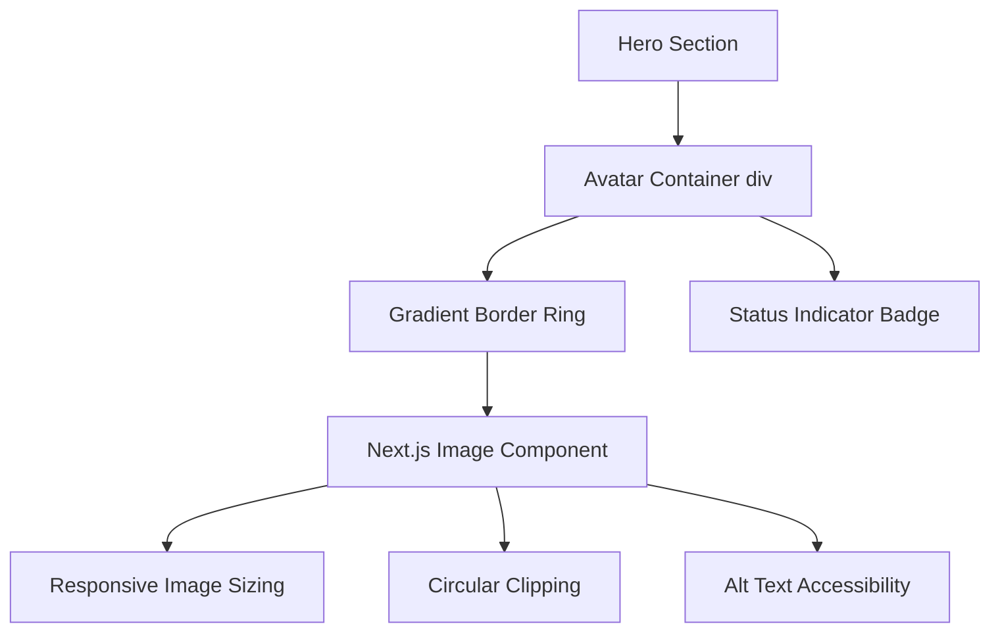

# Add Photo to Hero Section

## Overview

This design document outlines the implementation for adding a personal photo to the hero section of the portfolio website. The current hero section displays initials "AR" in a styled avatar circle, which will be replaced with the uploaded photo while maintaining the existing visual design and responsive behavior.

## Current Implementation Analysis

### Hero Section Structure
The hero section is located in `app/page.tsx` within the Home component's return statement. The current avatar implementation uses:



### Current Avatar Component
- **Container**: `h-32 w-32` circle with gradient border (`from-cyan-400 to-purple-400`)
- **Inner Circle**: Dark background (`bg-slate-900`) containing "AR" initials
- **Status Badge**: Green indicator with pulsing animation positioned absolutely at top-right
- **Styling**: Centered layout with responsive design

## Design Requirements

### Functional Requirements
1. **Photo Integration**: Replace text initials with the uploaded photo (`Gemini_Generated_Image_vv0xjdvv0xjdvv0x.png`)
2. **Preserve Visual Design**: Maintain existing gradient border and status indicator
3. **Image Optimization**: Use Next.js Image component for optimal performance
4. **Responsive Behavior**: Ensure photo displays correctly across all device sizes
5. **Accessibility**: Provide appropriate alt text for screen readers

### Technical Requirements
1. **Next.js Image Component**: Utilize optimized image loading and rendering
2. **Aspect Ratio**: Maintain circular aspect ratio for the photo
3. **Image Sizing**: Ensure photo fits properly within the 128px x 128px container
4. **Performance**: Implement proper image optimization and lazy loading
5. **Fallback Handling**: Include graceful fallback if image fails to load

## Implementation Strategy

### Photo Component Architecture



### Image Configuration
1. **Source Path**: `/Gemini_Generated_Image_vv0xjdvv0xjdvv0x.png`
2. **Dimensions**: 128x128 pixels to match container
3. **Object Fit**: Cover to maintain aspect ratio
4. **Border Radius**: Full circular clipping (`rounded-full`)
5. **Priority Loading**: Enable for above-the-fold content

### CSS Modifications
- **Container Structure**: Maintain existing gradient border wrapper
- **Image Sizing**: Apply `w-full h-full` for responsive filling
- **Border Radius**: Apply `rounded-full` for circular clipping
- **Object Fit**: Use `object-cover` to handle aspect ratio
- **Position**: Center image within container

## Component Implementation

### Updated Avatar Structure
```typescript
// Replace the existing initials div with Next.js Image
<div className="mx-auto h-32 w-32 rounded-full bg-gradient-to-r from-cyan-400 to-purple-400 p-1">
  <div className="relative h-full w-full rounded-full overflow-hidden">
    <Image
      src="/Gemini_Generated_Image_vv0xjdvv0xjdvv0x.png"
      alt="Allan Rojas D. - Senior Cloud & Full Stack Engineer"
      fill
      className="object-cover"
      priority
      sizes="128px"
    />
  </div>
</div>
```

### Image Properties Configuration
- **`src`**: Path to the uploaded photo in public directory
- **`alt`**: Descriptive text including name and professional title
- **`fill`**: Boolean for responsive container filling
- **`className`**: Tailwind classes for object-fit and styling
- **`priority`**: Enable for critical above-the-fold loading
- **`sizes`**: Specify exact dimensions for optimization

## Visual Design Consistency

### Gradient Border Preservation
- Maintain the existing `from-cyan-400 to-purple-400` gradient border
- Keep the 4px padding (`p-1`) for border thickness
- Preserve the circular shape with `rounded-full`

### Status Indicator Integration
- Keep the green status badge positioned at top-right
- Maintain the pulsing animation effect
- Ensure badge stays properly positioned over the photo

### Responsive Behavior
- Photo scales appropriately on mobile devices
- Circular clipping maintained across all screen sizes
- Image quality remains sharp on high-DPI displays

## Technical Implementation Details

### Next.js Image Optimization
1. **Automatic Format Selection**: WebP/AVIF when supported
2. **Responsive Sizing**: Multiple image variants for different devices
3. **Lazy Loading**: Disabled for hero section (priority loading)
4. **Quality Optimization**: Balanced file size and visual quality

### Performance Considerations
1. **Preload Priority**: Critical resource for above-the-fold content
2. **Image Sizing**: Exact dimensions specified to prevent layout shifts
3. **Format Optimization**: Modern formats for supported browsers
4. **Caching Strategy**: Browser and CDN caching for repeat visits

### Accessibility Features
1. **Alt Text**: Descriptive text identifying the person and role
2. **Semantic HTML**: Proper image element structure
3. **Focus Management**: Keyboard navigation compatibility
4. **Screen Reader**: Clear identification of profile photo

## Integration Points

### Component Dependencies
- **Next.js Image**: Import from `'next/image'` (already imported)
- **Tailwind CSS**: Existing utility classes for styling
- **React**: Functional component structure (existing)

### File Organization
- **Photo Location**: `/public/Gemini_Generated_Image_vv0xjdvv0xjdvv0x.png`
- **Component Location**: `app/page.tsx` hero section
- **Styling**: Inline Tailwind classes within JSX

### Browser Compatibility
- **Modern Browsers**: Full Next.js Image support
- **Legacy Browsers**: Automatic fallback to standard img tag
- **Mobile Devices**: Responsive image loading and display

## Testing Strategy

### Visual Verification
1. **Desktop Display**: Verify circular photo with gradient border
2. **Mobile Responsive**: Test photo display on various screen sizes
3. **Image Quality**: Ensure sharp rendering across devices
4. **Status Badge**: Confirm badge positioning over photo

### Performance Testing
1. **Loading Speed**: Measure image load times
2. **Layout Stability**: Verify no cumulative layout shift
3. **Network Optimization**: Test different connection speeds
4. **Caching Behavior**: Verify proper browser caching

### Accessibility Testing
1. **Screen Reader**: Test alt text announcement
2. **Keyboard Navigation**: Verify focus behavior
3. **High Contrast**: Test visibility in accessibility modes
4. **Zoom Functionality**: Test image scaling at high zoom levels