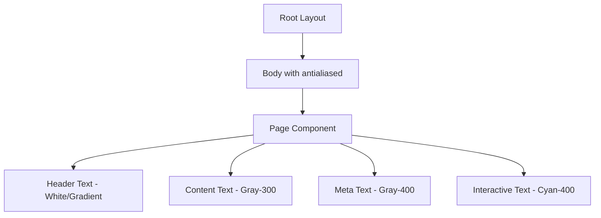
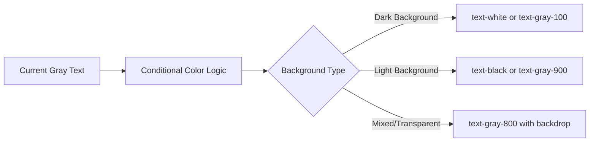
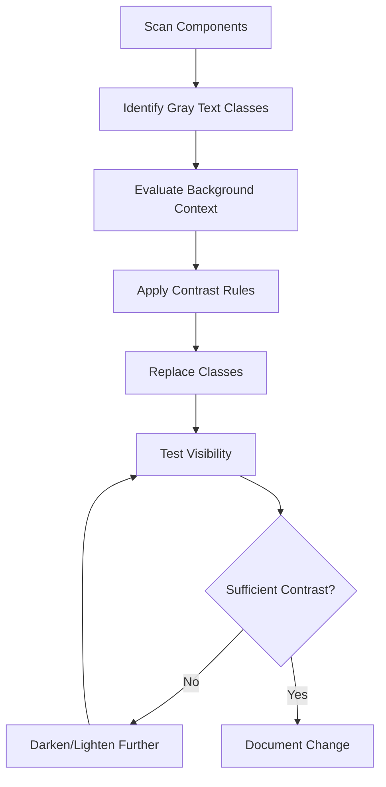
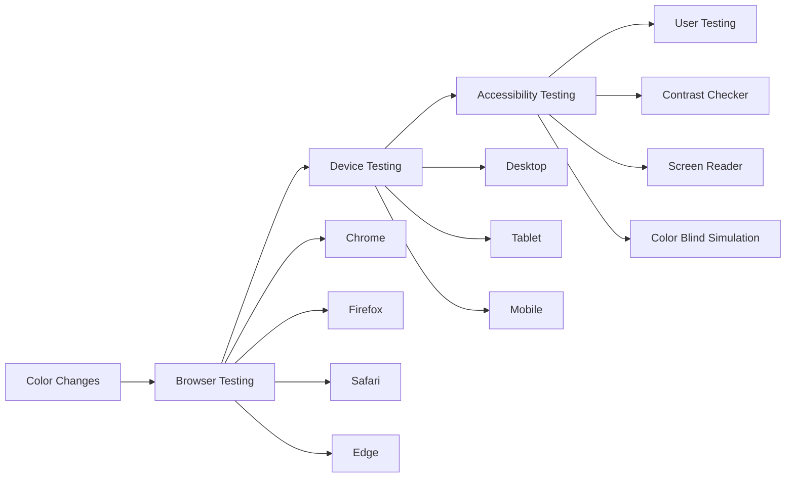

# CSS Text Color Fix Design

## Overview
This design addresses the issue where CSS text appears gray instead of the intended black color in the portfolio website. The problem likely stems from Tailwind CSS default color inheritance, opacity settings, or conflicting color declarations that override explicit text color values.

## Frontend Architecture

### Current Color System Analysis
The portfolio currently uses a comprehensive color scheme with:
- **Background**: Dark gradient (`bg-gradient-to-br from-slate-900 via-purple-900 to-slate-900`)
- **Primary Text**: White (`text-white`) for headers and main content
- **Secondary Text**: Gray variants (`text-gray-300`, `text-gray-400`) for descriptions
- **Accent Colors**: Cyan and purple gradients for interactive elements

### Text Color Hierarchy


### Identified Color Issues

#### Problem Areas
1. **Inherited Gray Colors**: Multiple elements use `text-gray-300` and `text-gray-400` which may appear too light
2. **Opacity Conflicts**: Background opacity settings (`bg-opacity-5`, `bg-opacity-10`) may affect text visibility
3. **Missing Explicit Black Text**: No explicit `text-black` declarations where pure black is needed
4. **Contrast Issues**: Light gray text on semi-transparent backgrounds may reduce readability

#### Color Usage Patterns
| Element Type | Current Color Class | Perceived Issue |
|--------------|-------------------|-----------------|
| Primary Headers | `text-white` | Correct |
| Gradient Headers | `bg-clip-text text-transparent` | Correct |
| Body Text | `text-gray-300` | Too light/gray |
| Meta Information | `text-gray-400` | Too light/gray |
| Contact Info | `text-gray-400` | Too light/gray |
| Tech Stack | `text-gray-300` | Too light/gray |

## CSS Text Color Solution Strategy

### 1. Color System Refinement

#### Black Text Implementation


#### Color Mapping Strategy
- **Pure Black Text**: `text-black` for maximum contrast on light backgrounds
- **Near Black Text**: `text-gray-900` for softer black on light backgrounds  
- **Dark Gray Text**: `text-gray-800` for readable text on medium backgrounds
- **High Contrast White**: `text-white` for dark backgrounds (current)

### 2. Component-Level Color Fixes

#### Text Color Override System
```mermaid
flowchart TD
    A[Component] --> B{Background Context}
    B -->|Dark Theme| C[Light Text Colors]
    B -->|Light Theme| D[Dark Text Colors]
    B -->|Dynamic| E[Contrast-Based Selection]
    
    C --> C1[text-white]
    C --> C2[text-gray-100]
    C --> C3[text-gray-200]
    
    D --> D1[text-black]
    D --> D2[text-gray-900]
    D --> D3[text-gray-800]
    
    E --> E1[CSS contrast() function]
    E --> E2[JavaScript contrast calculation]
```

#### Specific Component Solutions

**Header Section**
- Name: Keep gradient text (`bg-clip-text text-transparent`)
- Title: Keep `text-gray-300` or upgrade to `text-gray-200`
- Contact Info: Change from `text-gray-400` to `text-gray-300` or `text-white`

**Content Sections**
- Main text: Replace `text-gray-300` with `text-gray-100` or `text-white`
- Description text: Use `text-gray-200` instead of `text-gray-300`
- Tech stack labels: Use `text-gray-100` for better visibility

**Interactive Elements**
- Maintain current cyan/purple accent colors
- Ensure hover states use sufficient contrast ratios

### 3. CSS Implementation Approach

#### Tailwind Class Replacement Strategy


#### Custom CSS Utility Classes
For cases where Tailwind classes aren't sufficient:
- `.text-high-contrast` - Dynamic black/white based on background
- `.text-readable` - Optimized gray for current dark theme
- `.text-accessible` - WCAG AA compliant contrast ratios

### 4. Accessibility Considerations

#### Contrast Ratio Requirements
| Text Type | Minimum Ratio | Target Colors |
|-----------|---------------|---------------|
| Large Text (18pt+) | 3:1 | `text-gray-200` on dark backgrounds |
| Normal Text | 4.5:1 | `text-gray-100` or `text-white` on dark backgrounds |
| UI Text | 4.5:1 | High contrast for interactive elements |

#### Color Blindness Support
- Avoid relying solely on color for information
- Maintain sufficient brightness contrast
- Test with color blindness simulators

### 5. Testing Strategy

#### Visual Testing Checklist


#### Test Cases
1. **Light Theme Compatibility**: Verify black text works if theme switching is added
2. **Print Styles**: Ensure black text prints correctly
3. **High Contrast Mode**: Compatible with OS high contrast settings
4. **Dark Mode**: Current dark theme text visibility
5. **Mobile Devices**: Text readability on various screen sizes and brightness levels

### 6. Implementation Priority

#### Phase 1: Critical Text Fixes
- Replace `text-gray-400` with `text-gray-200` or `text-white` for contact information
- Update `text-gray-300` to `text-gray-100` for main content text
- Add explicit black text classes for any light background scenarios

#### Phase 2: Enhancement
- Implement custom contrast utility classes
- Add CSS custom properties for dynamic color switching
- Create responsive text color utilities

#### Phase 3: Future-Proofing
- Prepare for light/dark theme toggle functionality
- Implement CSS color scheme detection
- Add animation-safe color transitions

### 7. Code Quality Standards

#### CSS Organization
- Group color-related utilities in dedicated sections
- Use consistent naming conventions for custom color classes
- Document color choices with comments explaining contrast ratios
- Maintain separation between structural and color-based styling

#### Performance Considerations
- Minimize CSS specificity conflicts
- Use Tailwind's built-in classes when possible
- Avoid inline styles for color declarations
- Leverage CSS custom properties for dynamic colors