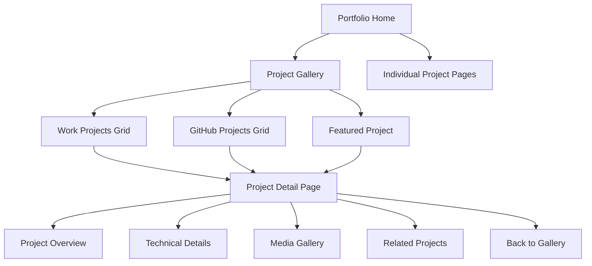
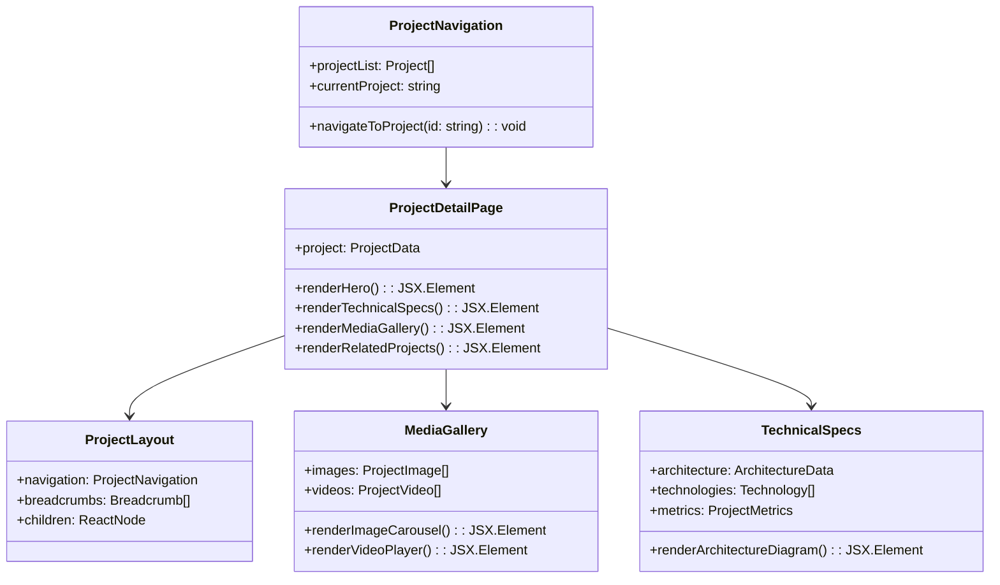
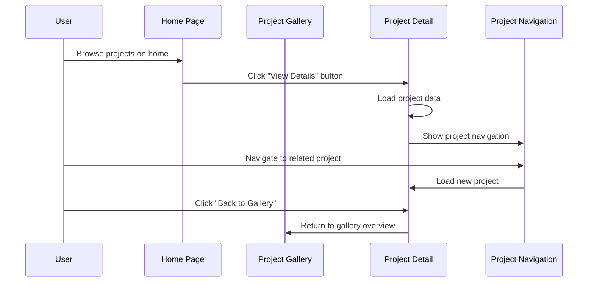
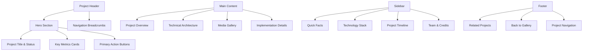
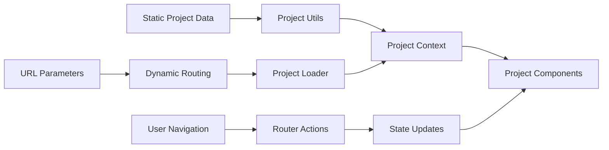

# Project Page Isolation Feature Design

## Overview

This design outlines the implementation of isolated project pages within the Allan Rojas portfolio website. Instead of linking to external sites, each project will have its own dedicated page within the application, keeping users engaged within the portfolio ecosystem while providing comprehensive project details.

## Architecture

### Current State Analysis

The portfolio currently displays projects in two main sections:
- **Work Projects**: Professional enterprise-level projects with detailed information
- **GitHub Projects**: Open source repositories with basic metadata

Currently, projects link to external resources:
- Work projects link to documentation, demos, and GitHub repositories
- GitHub projects link directly to GitHub repositories
- Featured project links to an external website (laviejadventures.com)

### Target Architecture



## Component Architecture

### New Components Structure



### File Structure

```
app/
├── projects/
│   ├── page.tsx                    # Project gallery overview
│   ├── [slug]/
│   │   ├── page.tsx               # Individual project page
│   │   └── loading.tsx            # Loading state
│   └── components/
│       ├── ProjectCard.tsx        # Enhanced project card
│       ├── ProjectGrid.tsx        # Project grid layout
│       ├── ProjectNavigation.tsx  # Project-to-project navigation
│       ├── MediaGallery.tsx       # Image/video gallery
│       ├── TechnicalSpecs.tsx     # Technical specifications
│       └── RelatedProjects.tsx    # Related projects section
├── components/
│   ├── ui/
│   │   ├── Breadcrumb.tsx         # Navigation breadcrumbs
│   │   ├── ImageModal.tsx         # Full-screen image viewer
│   │   └── VideoPlayer.tsx        # Embedded video player
│   └── layout/
│       └── ProjectLayout.tsx      # Shared project page layout
└── lib/
    ├── projectData.ts             # Centralized project data
    ├── projectUtils.ts            # Project utility functions
    └── types/
        └── project.ts             # TypeScript interfaces
```

## Routing & Navigation

### URL Structure

```
/                                  # Home page
/projects                         # Project gallery overview
/projects/[slug]                  # Individual project pages

# Example URLs:
/projects/enterprise-event-hub
/projects/multi-cloud-infrastructure
/projects/graphql-api-gateway
/projects/luxury-ride-hailing
/projects/medical-manufacturing-analytics
/projects/cloud-infrastructure-terraform
/projects/react-microservices-dashboard
```

### Navigation Flow



## Data Models & Interfaces

### Enhanced Project Interface

```typescript
interface ProjectDetail extends WorkProject {
  slug: string
  featured: boolean
  gallery: MediaGallery
  architecture: ArchitectureData
  relatedProjects: string[]
  externalLinks: ExternalLinks
  timeline: ProjectTimeline[]
}

interface MediaGallery {
  hero: ProjectImage
  screenshots: ProjectImage[]
  diagrams: ProjectImage[]
  videos: ProjectVideo[]
}

interface ArchitectureData {
  overview: string
  diagrams: ArchitectureDiagram[]
  components: SystemComponent[]
  dataFlow: DataFlowStep[]
}

interface ProjectTimeline {
  phase: string
  duration: string
  milestones: string[]
  deliverables: string[]
}

interface ExternalLinks {
  repository?: string
  documentation?: string
  liveDemo?: string
  caseStudy?: string
}
```

### Project Categories & Filtering

```typescript
type ProjectCategory = 
  | 'enterprise' 
  | 'cloud-infrastructure' 
  | 'api-development' 
  | 'full-stack' 
  | 'devops'
  | 'open-source'

interface ProjectFilter {
  categories: ProjectCategory[]
  technologies: string[]
  companies: string[]
  featured: boolean
}
```

## UI Components Design

### Project Detail Page Layout



### Responsive Design Strategy

```css
/* Mobile-first responsive design */
.project-detail {
  /* Mobile (default) */
  grid-template-columns: 1fr;
  gap: 1.5rem;
}

@media (min-width: 768px) {
  /* Tablet */
  .project-detail {
    grid-template-columns: 2fr 1fr;
    gap: 2rem;
  }
}

@media (min-width: 1024px) {
  /* Desktop */
  .project-detail {
    grid-template-columns: 3fr 1fr;
    gap: 3rem;
  }
}
```

## State Management

### Project Data Flow



### Data Loading Strategy

```typescript
// Static data generation at build time
export async function generateStaticParams() {
  return projectsData.map((project) => ({
    slug: project.slug,
  }))
}

// Project data fetching
export async function getProjectBySlug(slug: string): Promise<ProjectDetail | null> {
  return projectsData.find(project => project.slug === slug) || null
}
```

## Media Management

### Image Gallery Component

```typescript
interface ImageGallery {
  images: ProjectImage[]
  layout: 'grid' | 'carousel' | 'masonry'
  lightbox: boolean
  lazyLoading: boolean
}

interface ProjectImage {
  src: string
  alt: string
  title?: string
  description?: string
  category: 'screenshot' | 'diagram' | 'mockup' | 'chart'
  dimensions: { width: number; height: number }
}
```

### Video Integration

```typescript
interface ProjectVideo {
  type: 'youtube' | 'local' | 'embed'
  src: string
  title: string
  description?: string
  thumbnail: string
  duration?: string
}
```

## Performance Optimization

### Image Optimization Strategy

```typescript
// Next.js Image component with optimization
<Image
  src={image.src}
  alt={image.alt}
  width={image.dimensions.width}
  height={image.dimensions.height}
  quality={85}
  loading="lazy"
  placeholder="blur"
  blurDataURL="data:image/jpeg;base64,..."
/>
```

### Code Splitting

```typescript
// Lazy loading for heavy components
const MediaGallery = dynamic(() => import('./MediaGallery'), {
  loading: () => <MediaGallerySkeleton />,
  ssr: false
})

const ArchitectureDiagram = dynamic(() => import('./ArchitectureDiagram'), {
  loading: () => <DiagramSkeleton />
})
```

## Accessibility Features

### Keyboard Navigation

```typescript
// Enhanced keyboard navigation
const useKeyboardNavigation = (projects: ProjectDetail[]) => {
  useEffect(() => {
    const handleKeyDown = (event: KeyboardEvent) => {
      switch (event.key) {
        case 'ArrowLeft':
          navigateToPrevious()
          break
        case 'ArrowRight':
          navigateToNext()
          break
        case 'Escape':
          returnToGallery()
          break
      }
    }
    
    document.addEventListener('keydown', handleKeyDown)
    return () => document.removeEventListener('keydown', handleKeyDown)
  }, [])
}
```

### Screen Reader Support

```typescript
// ARIA labels and semantic HTML
<nav aria-label="Project navigation">
  <ol className="breadcrumb">
    <li><Link href="/">Home</Link></li>
    <li><Link href="/projects">Projects</Link></li>
    <li aria-current="page">{project.title}</li>
  </ol>
</nav>

<main role="main" aria-labelledby="project-title">
  <h1 id="project-title">{project.title}</h1>
  <section aria-labelledby="overview-heading">
    <h2 id="overview-heading">Project Overview</h2>
  </section>
</main>
```

## SEO & Meta Data

### Dynamic Meta Tags

```typescript
// Metadata generation for each project
export async function generateMetadata({ params }: { params: { slug: string } }) {
  const project = await getProjectBySlug(params.slug)
  
  if (!project) {
    return {
      title: 'Project Not Found - Allan Rojas Portfolio'
    }
  }
  
  return {
    title: `${project.title} - Allan Rojas Portfolio`,
    description: project.description,
    keywords: project.technologies.join(', '),
    openGraph: {
      title: project.title,
      description: project.description,
      images: [project.gallery.hero.src],
      type: 'article'
    },
    twitter: {
      card: 'summary_large_image',
      title: project.title,
      description: project.description,
      images: [project.gallery.hero.src]
    }
  }
}
```

### Structured Data

```typescript
// JSON-LD structured data for better SEO
const projectStructuredData = {
  "@context": "https://schema.org",
  "@type": "SoftwareApplication",
  "name": project.title,
  "description": project.description,
  "author": {
    "@type": "Person",
    "name": "Allan Rojas D."
  },
  "programmingLanguage": project.technologies,
  "dateCreated": project.timeframe,
  "applicationCategory": project.category
}
```

## Testing Strategy

### Component Testing

```typescript
// Jest + React Testing Library
describe('ProjectDetailPage', () => {
  test('renders project information correctly', () => {
    render(<ProjectDetailPage project={mockProject} />)
    expect(screen.getByRole('heading', { name: mockProject.title })).toBeInTheDocument()
    expect(screen.getByText(mockProject.description)).toBeInTheDocument()
  })
  
  test('navigates between projects using keyboard', () => {
    render(<ProjectDetailPage project={mockProject} />)
    fireEvent.keyDown(document, { key: 'ArrowRight' })
    expect(mockNavigateToNext).toHaveBeenCalled()
  })
})
```

### Integration Testing

```typescript
// E2E testing with Playwright
test('project navigation flow', async ({ page }) => {
  await page.goto('/')
  await page.click('[data-testid="project-card-enterprise-event-hub"]')
  await expect(page).toHaveURL('/projects/enterprise-event-hub')
  await expect(page.locator('h1')).toContainText('Microservices Event Hub')
  
  await page.click('[data-testid="next-project"]')
  await expect(page).toHaveURL('/projects/multi-cloud-infrastructure')
})
```  relatedProjects: string[]
  externalLinks: ExternalLinks
  timeline: ProjectTimeline[]
}

interface MediaGallery {
  hero: ProjectImage
  screenshots: ProjectImage[]
  diagrams: ProjectImage[]
  videos: ProjectVideo[]
}

interface ArchitectureData {
  overview: string
  diagrams: ArchitectureDiagram[]
  components: SystemComponent[]
  dataFlow: DataFlowStep[]
}

interface ProjectTimeline {
  phase: string
  duration: string
  milestones: string[]
  deliverables: string[]
}

interface ExternalLinks {
  repository?: string
  documentation?: string
  liveDemo?: string
  caseStudy?: string
}
```

### Project Categories & Filtering

```typescript
type ProjectCategory = 
  | 'enterprise' 
  | 'cloud-infrastructure' 
  | 'api-development' 
  | 'full-stack' 
  | 'devops'
  | 'open-source'

interface ProjectFilter {
  categories: ProjectCategory[]
  technologies: string[]
  companies: string[]
  featured: boolean
}
```

## UI Components Design

### Project Detail Page Layout


### Responsive Design Strategy

```css
/* Mobile-first responsive design */
.project-detail {
  /* Mobile (default) */
  grid-template-columns: 1fr;
  gap: 1.5rem;
}

@media (min-width: 768px) {
  /* Tablet */
  .project-detail {
    grid-template-columns: 2fr 1fr;
    gap: 2rem;
  }
}

@media (min-width: 1024px) {
  /* Desktop */
  .project-detail {
    grid-template-columns: 3fr 1fr;
    gap: 3rem;
  }
}
```

## State Management

### Project Data Flow


### Data Loading Strategy

```typescript
// Static data generation at build time
export async function generateStaticParams() {
  return projectsData.map((project) => ({
    slug: project.slug,
  }))
}

// Project data fetching
export async function getProjectBySlug(slug: string): Promise<ProjectDetail | null> {
  return projectsData.find(project => project.slug === slug) || null
}
```

## Media Management

### Image Gallery Component

```typescript
interface ImageGallery {
  images: ProjectImage[]
  layout: 'grid' | 'carousel' | 'masonry'
  lightbox: boolean
  lazyLoading: boolean
}

interface ProjectImage {
  src: string
  alt: string
  title?: string
  description?: string
  category: 'screenshot' | 'diagram' | 'mockup' | 'chart'
  dimensions: { width: number; height: number }
}
```

### Video Integration

```typescript
interface ProjectVideo {
  type: 'youtube' | 'local' | 'embed'
  src: string
  title: string
  description?: string
  thumbnail: string
  duration?: string
}
```

## Performance Optimization

### Image Optimization Strategy

```typescript
// Next.js Image component with optimization
<Image
  src={image.src}
  alt={image.alt}
  width={image.dimensions.width}
  height={image.dimensions.height}
  quality={85}
  loading="lazy"
  placeholder="blur"
  blurDataURL="data:image/jpeg;base64,..."
/>
```

### Code Splitting

```typescript
// Lazy loading for heavy components
const MediaGallery = dynamic(() => import('./MediaGallery'), {
  loading: () => <MediaGallerySkeleton />,
  ssr: false
})

const ArchitectureDiagram = dynamic(() => import('./ArchitectureDiagram'), {
  loading: () => <DiagramSkeleton />
})
```

## Accessibility Features

### Keyboard Navigation

```typescript
// Enhanced keyboard navigation
const useKeyboardNavigation = (projects: ProjectDetail[]) => {
  useEffect(() => {
    const handleKeyDown = (event: KeyboardEvent) => {
      switch (event.key) {
        case 'ArrowLeft':
          navigateToPrevious()
          break
        case 'ArrowRight':
          navigateToNext()
          break
        case 'Escape':
          returnToGallery()
          break
      }
    }
    
    document.addEventListener('keydown', handleKeyDown)
    return () => document.removeEventListener('keydown', handleKeyDown)
  }, [])
}
```

### Screen Reader Support

```typescript
// ARIA labels and semantic HTML
<nav aria-label="Project navigation">
  <ol className="breadcrumb">
    <li><Link href="/">Home</Link></li>
    <li><Link href="/projects">Projects</Link></li>
    <li aria-current="page">{project.title}</li>
  </ol>
</nav>

<main role="main" aria-labelledby="project-title">
  <h1 id="project-title">{project.title}</h1>
  <section aria-labelledby="overview-heading">
    <h2 id="overview-heading">Project Overview</h2>
  </section>
</main>
```

## SEO & Meta Data

### Dynamic Meta Tags

```typescript
// Metadata generation for each project
export async function generateMetadata({ params }: { params: { slug: string } }) {
  const project = await getProjectBySlug(params.slug)
  
  if (!project) {
    return {
      title: 'Project Not Found - Allan Rojas Portfolio'
    }
  }
  
  return {
    title: `${project.title} - Allan Rojas Portfolio`,
    description: project.description,
    keywords: project.technologies.join(', '),
    openGraph: {
      title: project.title,
      description: project.description,
      images: [project.gallery.hero.src],
      type: 'article'
    },
    twitter: {
      card: 'summary_large_image',
      title: project.title,
      description: project.description,
      images: [project.gallery.hero.src]
    }
  }
}
```

### Structured Data

```typescript
// JSON-LD structured data for better SEO
const projectStructuredData = {
  "@context": "https://schema.org",
  "@type": "SoftwareApplication",
  "name": project.title,
  "description": project.description,
  "author": {
    "@type": "Person",
    "name": "Allan Rojas D."
  },
  "programmingLanguage": project.technologies,
  "dateCreated": project.timeframe,
  "applicationCategory": project.category
}
```

## Testing Strategy

### Component Testing

```typescript
// Jest + React Testing Library
describe('ProjectDetailPage', () => {
  test('renders project information correctly', () => {
    render(<ProjectDetailPage project={mockProject} />)
    expect(screen.getByRole('heading', { name: mockProject.title })).toBeInTheDocument()
    expect(screen.getByText(mockProject.description)).toBeInTheDocument()
  })
  
  test('navigates between projects using keyboard', () => {
    render(<ProjectDetailPage project={mockProject} />)
    fireEvent.keyDown(document, { key: 'ArrowRight' })
    expect(mockNavigateToNext).toHaveBeenCalled()
  })
})
```

### Integration Testing

```typescript
// E2E testing with Playwright
test('project navigation flow', async ({ page }) => {
  await page.goto('/')
  await page.click('[data-testid="project-card-enterprise-event-hub"]')
  await expect(page).toHaveURL('/projects/enterprise-event-hub')
  await expect(page.locator('h1')).toContainText('Microservices Event Hub')
  
  await page.click('[data-testid="next-project"]')
  await expect(page).toHaveURL('/projects/multi-cloud-infrastructure')
})
```


