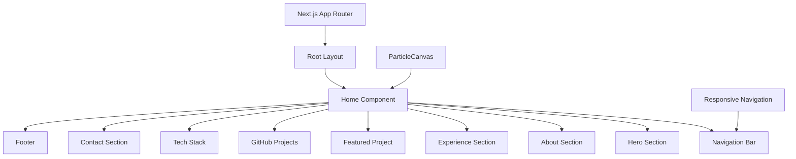
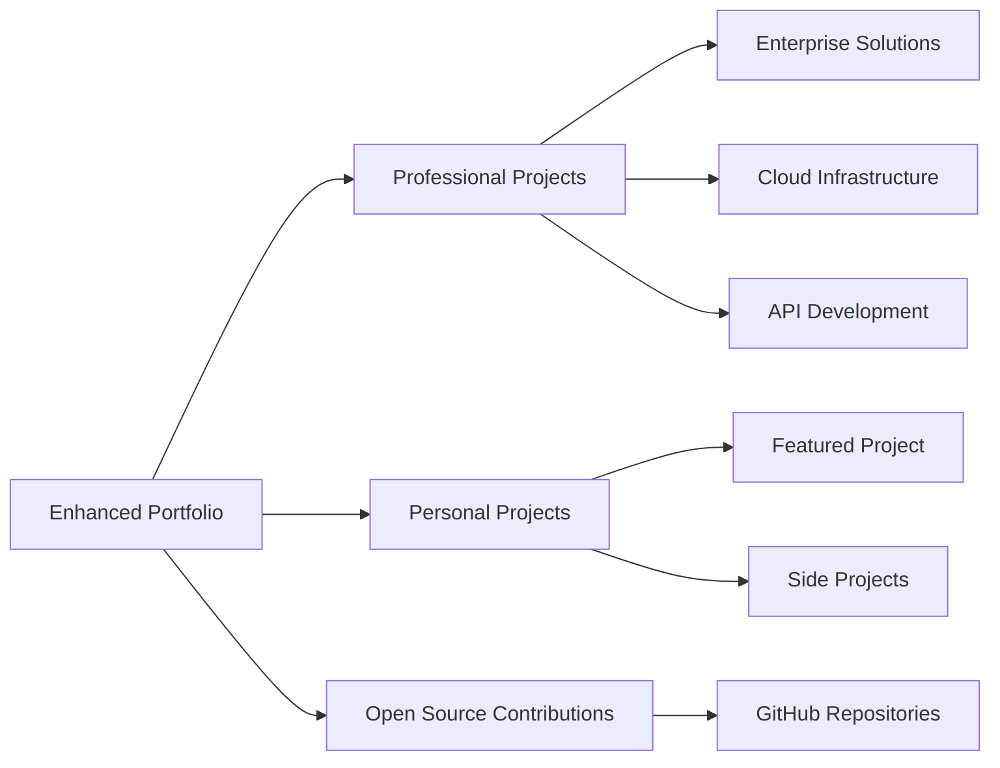
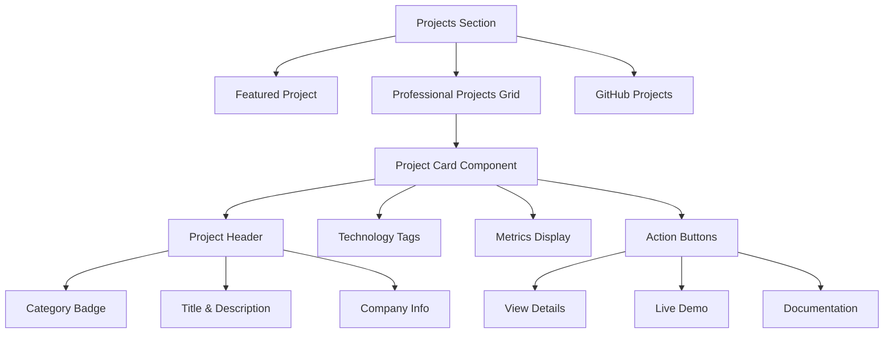

# Portfolio Project Review and Enhancement Design

## Overview

This document outlines the comprehensive review of Allan Rojas D.'s portfolio website and the design for adding 5 work-related projects to enhance the professional showcase. The portfolio is built with Next.js 15, TypeScript, and Tailwind CSS, following modern web development best practices with a focus on performance, accessibility, and user experience.

## Current Portfolio Analysis

### Architecture Assessment

The portfolio follows a **Single Page Application (SPA)** pattern with component-based architecture:



### Technology Stack Evaluation

| Category | Current Technologies | Assessment |
|----------|---------------------|------------|
| **Framework** | Next.js 15.4.3 | ✅ Modern, production-ready |
| **Language** | TypeScript 5+ | ✅ Type-safe, maintainable |
| **Styling** | Tailwind CSS 4 | ✅ Utility-first, responsive |
| **Icons** | Emoji + lucide-react | ✅ Accessible, lightweight |
| **Animation** | Custom Canvas + CSS | ✅ Performance-optimized |
| **Build Tool** | Turbopack | ✅ Fast development |

### Current Content Structure

```typescript
interface Portfolio {
  hero: PersonalInfo
  about: Biography
  experience: Experience[]     // 3 positions
  featuredProject: Project    // 1 project (La Vieja Adventures)
  githubProjects: GitHubRepo[] // 4 repositories
  skills: Skill[]             // 4 skill categories
  techStack: TechStack        // 5 categories
  contact: ContactInfo
}
```

### Strengths Identified

1. **Performance Optimization**
   - Next.js font optimization with Geist fonts
   - Lazy-loaded animations with reduced motion support
   - Efficient Canvas-based particle system
   - Static generation capabilities

2. **Accessibility Features**
   - Skip-to-content link
   - ARIA labels and semantic HTML
   - WCAG 2.1 compliant color contrast
   - Keyboard navigation support

3. **User Experience**
   - Smooth scroll navigation
   - Active section highlighting
   - Responsive design (mobile-first)
   - Interactive hover effects

4. **Code Quality**
   - TypeScript interfaces for type safety
   - Component modularity
   - Clean separation of concerns
   - Consistent naming conventions

## Enhanced Project Portfolio Design

### Project Categories Architecture



### New Work-Related Projects Data Model

```typescript
interface WorkProject {
  id: string
  title: string
  category: 'enterprise' | 'cloud-infrastructure' | 'api-development' | 'full-stack' | 'devops'
  description: string
  longDescription: string
  technologies: string[]
  highlights: string[]
  metrics?: ProjectMetrics
  timeframe: string
  company?: string
  status: 'completed' | 'ongoing' | 'maintained'
  links?: ProjectLinks
  images?: ProjectImage[]
  testimonial?: Testimonial
}

interface ProjectMetrics {
  performance?: string
  scale?: string
  uptime?: string
  adoption?: string
}

interface ProjectLinks {
  live?: string
  documentation?: string
  demo?: string
}

interface ProjectImage {
  src: string
  alt: string
  caption?: string
}

interface Testimonial {
  text: string
  author: string
  role: string
  company: string
}
```

### Five Work-Related Projects Specification

#### 1. Enterprise Event-Driven Architecture Platform
```yaml
category: enterprise
title: "Microservices Event Hub"
description: "Scalable event-driven architecture processing 500K+ daily real-time events"
technologies: [Kafka, Node.js, Python, Docker, Kubernetes, AWS]
metrics:
  performance: "99.95% uptime"
  scale: "500K+ events/day"
  latency: "<50ms processing time"
highlights:
  - "Reduced system coupling by 70% through event-driven design"
  - "Implemented fault-tolerant message processing with dead letter queues"
  - "Built comprehensive monitoring and alerting dashboard"
company: "Wind River (Kaptyn)"
timeframe: "2022-2024"
```

#### 2. Multi-Cloud Infrastructure Automation
```yaml
category: cloud-infrastructure  
title: "Terraform Cloud Orchestrator"
description: "Infrastructure as Code solution managing AWS, GCP, and Azure environments"
technologies: [Terraform, AWS, GCP, Azure, GitLab CI/CD, Ansible]
metrics:
  performance: "60% faster deployments"
  scale: "100+ environment configs"
  reliability: "Zero-downtime deployments"
highlights:
  - "Standardized infrastructure patterns across cloud providers"
  - "Implemented blue-green deployment strategies"
  - "Created self-healing infrastructure with auto-scaling"
company: "Wind River (Kaptyn)"  
timeframe: "2023-2024"
```

#### 3. GraphQL API Gateway & Analytics Platform
```yaml
category: api-development
title: "Unified API Gateway"
description: "High-performance GraphQL gateway with real-time analytics and monitoring"
technologies: [GraphQL, Apollo Server, Node.js, PostgreSQL, Redis, DataDog]
metrics:
  performance: "10x faster than REST equivalent"
  scale: "1M+ requests/day"
  efficiency: "40% reduced bandwidth usage"
highlights:
  - "Built type-safe schema federation across 15+ microservices"
  - "Implemented intelligent caching strategies"
  - "Created comprehensive API analytics dashboard"
company: "Wind River (Kaptyn)"
timeframe: "2023-Present"
```

#### 4. Luxury Ride-Hailing Mobile Application
```yaml
category: full-stack
title: "Premium Transport Platform" 
description: "Real-time ride-hailing application with advanced booking and tracking features"
technologies: [React Native, Node.js, WebSockets, PostgreSQL, Google Maps API, Stripe]
metrics:
  performance: "Sub-2s booking confirmation"
  scale: "10K+ active users"
  reliability: "99.9% location accuracy"
highlights:
  - "Implemented real-time GPS tracking with WebSocket communication"
  - "Built sophisticated matching algorithm for drivers and passengers"
  - "Integrated payment processing with fraud detection"
company: "Costa Rica Software Services"
timeframe: "2021-2022"
```

#### 5. Medical Device Manufacturing Analytics System
```yaml
category: devops
title: "Manufacturing Intelligence Platform"
description: "Real-time production analytics and quality assurance system for medical devices"
technologies: [Java, Spring Boot, Python, Apache Spark, InfluxDB, Grafana]
metrics:
  performance: "Real-time data processing"
  scale: "100+ production lines"
  compliance: "FDA 21 CFR Part 11 compliant"
highlights:
  - "Built real-time quality monitoring preventing 95% of defects"
  - "Implemented traceability system for regulatory compliance"
  - "Created predictive maintenance algorithms reducing downtime by 30%"
company: "MicroVention-Terumo"
timeframe: "2018-2020"
```

## Enhanced Component Architecture

### Projects Section Redesign



### Project Card Component Design

```typescript
const ProjectCard: React.FC<{ project: WorkProject }> = ({ project }) => {
  return (
    <article className="group relative">
      {/* Gradient border effect */}
      <div className="absolute -inset-1 rounded-2xl bg-gradient-to-r opacity-0 blur transition duration-700 group-hover:opacity-100" />
      
      {/* Card content */}
      <div className="relative rounded-2xl border border-white/10 bg-white/5 p-6 backdrop-blur-sm">
        {/* Category badge */}
        <CategoryBadge category={project.category} />
        
        {/* Header */}
        <ProjectHeader 
          title={project.title}
          company={project.company}
          timeframe={project.timeframe}
        />
        
        {/* Description */}
        <ProjectDescription description={project.description} />
        
        {/* Metrics */}
        {project.metrics && <MetricsDisplay metrics={project.metrics} />}
        
        {/* Technology stack */}
        <TechnologyTags technologies={project.technologies} />
        
        {/* Key highlights */}
        <HighlightsList highlights={project.highlights} />
        
        {/* Action buttons */}
        <ProjectActions links={project.links} />
      </div>
    </article>
  )
}
```

## Navigation Enhancement Design

### Updated Navigation Structure

```typescript
const sections = [
  { id: 'about', label: 'About', icon: '👤' },
  { id: 'experience', label: 'Experience', icon: '💼' },
  { id: 'featured-project', label: 'Featured', icon: '⭐' },
  { id: 'work-projects', label: 'Work Projects', icon: '🏢' },
  { id: 'github-projects', label: 'Open Source', icon: '🚀' },
  { id: 'skills', label: 'Skills', icon: '🛠️' },
  { id: 'contact', label: 'Contact', icon: '📧' },
]
```

### Project Filtering System

```typescript
interface ProjectFilter {
  category: string[]
  technology: string[]
  company: string[]
}

const ProjectFilters: React.FC = () => {
  return (
    <div className="mb-8 flex flex-wrap gap-4">
      <FilterGroup
        title="Category"
        options={['enterprise', 'cloud-infrastructure', 'api-development', 'full-stack', 'devops']}
      />
      <FilterGroup
        title="Technology"  
        options={['Node.js', 'Python', 'AWS', 'Kubernetes', 'GraphQL']}
      />
      <FilterGroup
        title="Company"
        options={['Wind River', 'Costa Rica Software Services', 'MicroVention-Terumo']}
      />
    </div>
  )
}
```

## Performance and SEO Optimization

### Meta Tags Enhancement

```typescript
export const metadata: Metadata = {
  title: 'Allan Rojas D. - Senior Cloud & Full Stack Engineer',
  description: 'Experienced full-stack and cloud engineer specializing in scalable systems, microservices architecture, and DevOps practices. 8+ years building enterprise solutions.',
  keywords: [
    'full-stack developer', 'cloud engineer', 'microservices', 'devops',
    'react', 'node.js', 'aws', 'kubernetes', 'terraform', 'graphql'
  ],
  openGraph: {
    title: 'Allan Rojas D. - Senior Cloud & Full Stack Engineer',
    description: 'Portfolio showcasing enterprise projects, cloud infrastructure, and full-stack development expertise.',
    images: [{ url: '/og-image.jpg', width: 1200, height: 630 }]
  }
}
```

### Image Optimization Strategy

```typescript
const ProjectImage: React.FC<{ src: string; alt: string }> = ({ src, alt }) => {
  return (
    <Image
      src={src}
      alt={alt}
      width={600}
      height={400}
      priority={false}
      className="rounded-lg"
      placeholder="blur"
      blurDataURL="data:image/jpeg;base64,/9j/4AAQSkZJRgABAQAAAQABAAD/..."
    />
  )
}
```

## Responsive Design Implementation

### Mobile-First Grid System

```css
/* Project grid responsive breakpoints */
.projects-grid {
  @apply grid gap-6;
  
  /* Mobile: Single column */
  grid-template-columns: 1fr;
  
  /* Tablet: Two columns */
  @screen md {
    grid-template-columns: repeat(2, 1fr);
  }
  
  /* Desktop: Three columns for work projects, two for featured */
  @screen lg {
    grid-template-columns: repeat(3, 1fr);
  }
  
  /* Large desktop: Maintain three columns with max width */
  @screen xl {
    max-width: 1400px;
    margin: 0 auto;
  }
}
```

### Tablet and Mobile Adaptations

| Screen Size | Layout | Navigation | Project Cards |
|-------------|--------|------------|---------------|
| **Mobile (320-768px)** | Single column | Hamburger menu | Full width, stacked content |
| **Tablet (768-1024px)** | Two columns | Horizontal tabs | Side-by-side, condensed metrics |
| **Desktop (1024px+)** | Three columns | Full navigation | Grid layout, expanded content |

## Animation and Interaction Design

### Micro-Interactions Specification

```typescript
const animations = {
  projectCard: {
    hover: {
      scale: 1.02,
      borderOpacity: 0.5,
      glowIntensity: 1,
      duration: 300
    },
    click: {
      scale: 0.98,
      duration: 150
    }
  },
  
  filterTags: {
    active: {
      background: 'gradient-cyan-purple',
      textColor: 'white',
      scale: 1.05
    },
    inactive: {
      background: 'transparent',
      textColor: 'gray-400',
      scale: 1
    }
  },
  
  scrollReveal: {
    threshold: 0.1,
    rootMargin: '-10%',
    stagger: 100
  }
}
```

### Loading States and Transitions

```typescript
const LoadingStates = {
  initial: 'opacity-0 translate-y-6',
  loading: 'opacity-50 animate-pulse',
  loaded: 'opacity-100 translate-y-0 transition-all duration-700',
  error: 'opacity-75 border-red-500/50'
}
```

## Accessibility Enhancements

### Keyboard Navigation Support

```typescript
const KeyboardNavigation = {
  projectGrid: {
    arrowKeys: 'Navigate between project cards',
    enterSpace: 'Open project details',
    escape: 'Close modal/return to grid',
    tab: 'Focus management within cards'
  },
  
  filterSystem: {
    arrowKeys: 'Navigate filter options',
    enterSpace: 'Toggle filter state',
    escape: 'Clear all filters'
  }
}
```

### Screen Reader Optimizations

```typescript
const AriaLabels = {
  projectCard: (project: WorkProject) => 
    `${project.title} project at ${project.company}, built with ${project.technologies.join(', ')}`,
  
  metrics: (metrics: ProjectMetrics) =>
    `Performance metrics: ${Object.entries(metrics).map(([key, value]) => `${key}: ${value}`).join(', ')}`,
    
  filterButton: (category: string, active: boolean) =>
    `Filter by ${category}, ${active ? 'currently active' : 'inactive'}`
}
```

## Testing Strategy

### Component Testing Framework

```typescript
// Project card component test
describe('ProjectCard Component', () => {
  it('renders project information correctly', () => {
    render(<ProjectCard project={mockProject} />)
    expect(screen.getByText(mockProject.title)).toBeInTheDocument()
    expect(screen.getByText(mockProject.company)).toBeInTheDocument()
  })
  
  it('handles keyboard navigation', async () => {
    render(<ProjectCard project={mockProject} />)
    const card = screen.getByRole('article')
    
    fireEvent.keyDown(card, { key: 'Enter' })
    expect(mockOpenDetails).toHaveBeenCalled()
  })
  
  it('displays metrics when available', () => {
    const projectWithMetrics = { ...mockProject, metrics: mockMetrics }
    render(<ProjectCard project={projectWithMetrics} />)
    
    expect(screen.getByText('99.95% uptime')).toBeInTheDocument()
  })
})
```

### Performance Testing

```typescript
const PerformanceMetrics = {
  loadTime: '<2s initial page load',
  interactivity: '<100ms button responses',
  scrollPerformance: '60fps smooth scrolling',
  imageOptimization: 'WebP format, lazy loading',
  bundleSize: '<500kb gzipped JavaScript'
}
```